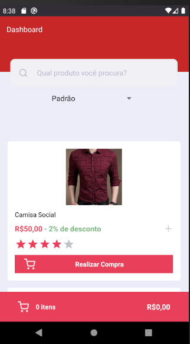
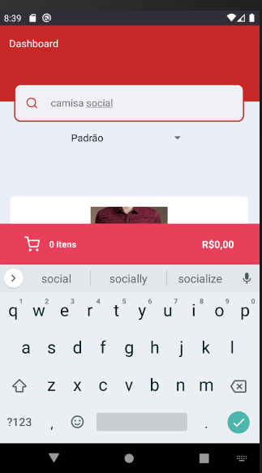
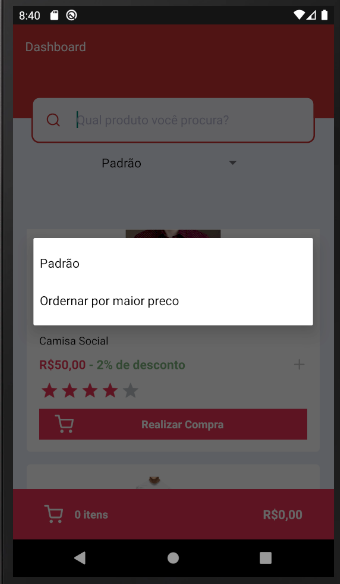
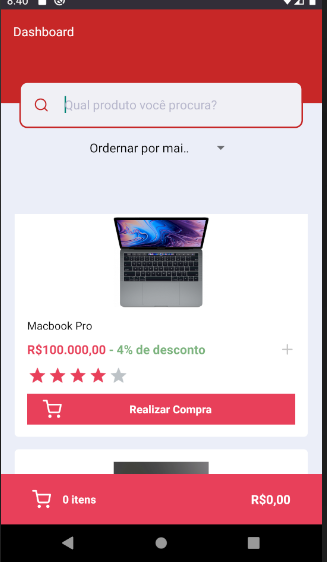
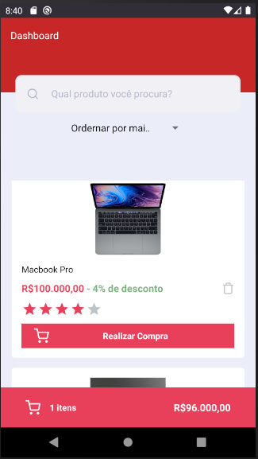
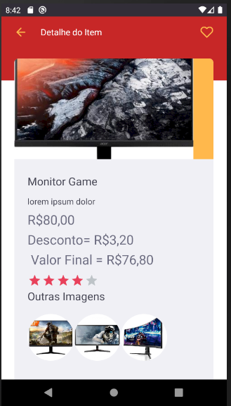
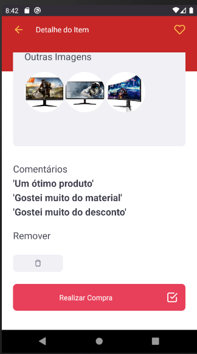
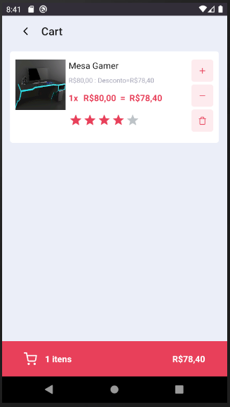
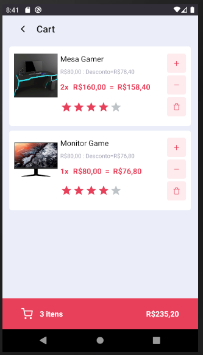
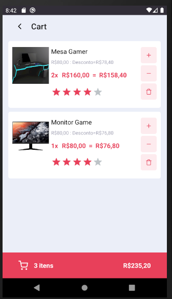

 Ecommerce app is an application developed in react-native and using async storage to save user purchases in the application's storage

- ⚛️ **React Native** —  Mobile framework that provides an efficient way to create native applications for Android and iOS.
    - Use of ⚛️ React Hooks.
    - Use of ⚛️ Context Api.
    - Use of axios for communication with api.
    - Use of the styled-coponents library.
    - Use of the react-navigation library for navigation between screens.
    - Use of the react-native-ratings;
    - Use of the react-native-vector-icons.
    - Use of the intl for format currency.
    - Use react-native-async-storage for save infos cart user in storage app.
    - Use json-server for mock api rest.
### Mobile:
Run the lines below to launch the application on your physical device or emulator.

    - yarn install.
    - npx react-native start
    - npx react-native run-android
    - To run fake api using json server inside the project run the command yarn json-server server.json -p 3333.
    - After opening the emulator use the command on the adb reverse terminal tcp: 3333 tcp: 3333. So the emulator will identify the host that is running the api.
    - As soon as the process is finished, the application will run on the device that was installed.

    - (if there is an error in the terminal referring to the project libraries, correct by synchronizing the project in android studio).

  

 
 

  

 
 

  

 
 

  

 
 

  

 
 

  

 
 

  

 
 

  

 
 

  

 

  

 

  

 

## Licence

This project is licensed under the MIT License - See the [license](https://opensource.org/licenses/MIT) for details.
